# 버블 정렬 (Bubble Sort)

## 개념

- 인접한 두 원소를 비교해서, 순서가 틀리면 그 자리에서 바로 스왑한다
- 배열 처음부터 끝까지 이 비교/스왑을 반복하는 게 한 번의 pass
- 한 pass가 끝나면 그 안에서 가장 큰 값이 맨 뒤로 밀려나 확정된다 — 거품이 위로 떠오르는 것처럼 보인다고 해서 "버블 정렬"
- pass를 거듭할수록 뒤쪽 확정 구간이 늘어나므로, 다음 pass는 그만큼 비교 범위를 줄일 수 있다

## 동작 과정

`[5, 2, 4, 1]`을 정렬하는 과정:



## 구현

```kotlin
fun bubbleSort(arr: IntArray) {
    for (i in 0..arr.size - 2) {
        for (j in 0..arr.size - 2 - i) {
            if (arr[j] > arr[j + 1]) {
                var tmp = arr[j]
                arr[j] = arr[j + 1]
                arr[j + 1] = tmp
            }
        }
    }
}
```

- 바깥 반복(`i`) — pass 횟수. `i`가 늘어날수록 뒤쪽 `i`개는 이미 확정됐으므로 안쪽 반복 범위가 줄어든다
- 안쪽 반복(`j`) — 인접한 `arr[j]`와 `arr[j+1]`을 비교, 순서가 틀리면 스왑

## 시간 복잡도

- 비교 횟수는 `(n-1) + (n-2) + ... + 1`, 즉 O(n²)
- 최악(역순 정렬)과 평균 모두 O(n²) — 항상 모든 인접 쌍을 비교하기 때문
- 이미 정렬된 배열이라도 기본 구현은 여전히 O(n²) 비교를 다 한다 — pass 중 스왑이 한 번도 없으면 그 자리에서 멈추는 최적화를 추가하면 최선의 경우 O(n)까지 줄일 수 있다

## 요약

- 인접 비교 + 즉시 스왑, pass마다 뒤에서부터 확정 구간이 늘어남
- O(n²) — 느리지만 구현이 가장 단순
- 안정 정렬(같은 값의 원래 순서가 유지됨) — 같은 값끼리는 스왑하지 않으므로
