# 선택 정렬 (Selection Sort)

## 개념

- 아직 정렬 안 된 구간 전체를 훑어서 최솟값을 찾은 다음, 그 값을 구간 맨 앞으로 딱 한 번만 스왑한다
- 버블 정렬과의 핵심 차이 — 버블은 비교할 때마다 그 자리에서 스왑하지만, 선택 정렬은 구간을 다 훑어서 최솟값을 확정한 뒤에야 스왑한다
- 그래서 한 pass(바깥 반복 한 번)당 스왑은 최대 1번뿐이다 — 최솟값이 이미 제자리에 있으면 그마저도 안 해도 된다

## 동작 과정

`[5, 2, 4, 1]`을 정렬하는 과정:



## 구현

```kotlin
fun selectionSort(arr: IntArray) {
    for (i in 0 until arr.size - 1) {
        var minIndex = i
        for (j in i + 1 until arr.size) {
            if (arr[j] < arr[minIndex]) {
                minIndex = j
            }
        }
        if (minIndex != i) {
            var tmp = arr[i]
            arr[i] = arr[minIndex]
            arr[minIndex] = tmp
        }
    }
}
```

- 바깥 반복(`i`) — "이 자리에 최솟값을 채워 넣겠다"는 위치
- 안쪽 반복(`j`) — `i`부터 끝까지 훑으면서 **최솟값의 인덱스**를 찾는다. 값 자체가 아니라 인덱스를 기억해야 나중에 스왑할 수 있다
- 안쪽 반복이 끝난 뒤에만 스왑 — `minIndex != i`일 때만 스왑해서, 이미 제자리인 경우 불필요한 스왑을 건너뛴다

## 시간 복잡도

- 비교 횟수는 버블 정렬과 똑같이 `(n-1) + (n-2) + ... + 1`, 즉 O(n²)
- 스왑 횟수는 최대 `n-1`번 — 버블 정렬은 최악의 경우 O(n²)번 스왑할 수 있는 것과 대조적
- 스왑 한 번의 비용이 비쌀 때(예: 큰 데이터를 통째로 옮겨야 할 때) 선택 정렬이 유리할 수 있다
- 안정 정렬이 아니다 — 최솟값을 멀리서 끌어와 앞자리와 통째로 바꾸는 과정에서, 같은 값끼리의 원래 순서가 뒤바뀔 수 있다

## 요약

- 구간을 다 훑어 최솟값을 찾은 뒤 한 번만 스왑, pass마다 앞에서부터 확정 구간이 늘어남
- 비교 O(n²)는 버블과 같지만, 스왑은 최대 O(n)번뿐
- 안정 정렬 아님 — 버블 정렬과의 또 다른 차이점
