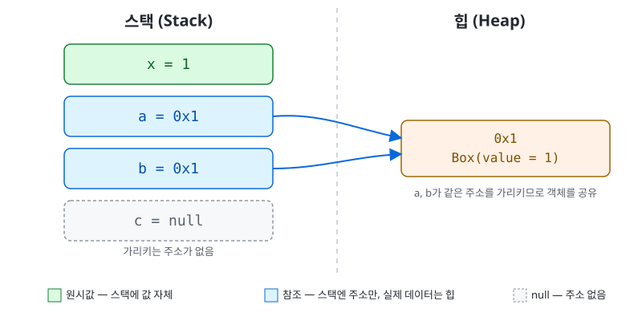

# 0.1 메모리와 참조

## 변수는 상자가 아니라 이름표

코틀린(자바 계열 언어 전반)에서 변수는 값을 담는 상자가 아니라, **객체에 붙이는 이름표(참조)**다. 파이썬도 사실 이렇게 동작한다(`x = [1,2,3]`도 리스트 객체에 이름표를 붙이는 것). 다만 코틀린은 이걸 타입 시스템 차원에서 명시적으로 구분한다.

두 종류가 있다.

- **원시 타입(primitive)** — `Int`, `Boolean`, `Double` 같은 것. 변수가 값 자체를 직접 들고 있다.
- **객체(object)** — `class`로 만든 모든 것. 변수는 객체가 아니라 "그 객체가 어디 있는지 가리키는 주소"만 들고 있다.

## 스택과 힙

메모리는 두 군데로 나뉜다.

- **스택(stack)** — 함수(또는 스크립트)가 실행되는 동안 지역 변수들이 쌓이는 곳. 원시값 또는 주소값이 저장된다.
- **힙(heap)** — 실제 객체 데이터가 저장되는 곳. `Box(1)`처럼 클래스 인스턴스를 만들면 이 데이터는 힙에 생기고, 변수는 그 주소만 스택에 들고 있다.

다음 코드를 기준으로 그리면:

```kotlin
class Box(var value: Int)

val x = 1
val a = Box(1)
val b = a
val c: Box? = null
```



`a`와 `b`는 서로 다른 이름이지만 **같은 주소(0x1)**를 들고 있다. 즉 같은 객체를 가리킨다. `c`는 아무 주소도 가리키지 않는 상태 — 이게 `null`이다.

## 참조 공유 시 mutation이 전파되는 이유

```kotlin
class Box(var value: Int)

val a = Box(1)
val b = a
b.value = 99

println(a.value) // 99
```

`val b = a`는 새 `Box` 객체를 만드는 게 아니라, `a`가 들고 있던 주소값을 그대로 `b`에 복사하는 것뿐이다. `a`와 `b`는 힙에 있는 **같은 객체**를 가리키므로, `b.value = 99`는 그 객체 내부 값을 바꾼 것이고 `a.value`도 당연히 99가 된다. 객체가 두 개 생긴 게 아니라 이름표가 두 개 생긴 것.

원시 타입은 다르다.

```kotlin
var x = 1
var y = x
y = 99

println(x) // 1
```

`y = x`는 `x`가 들고 있는 값 `1`을 그대로 복사한다. 스택에 값 자체가 있으니, 이후 `y`를 바꿔도 `x`는 전혀 영향받지 않는다.

## null — 주소가 없다는 뜻

```kotlin
class Box(var value: Int)

var d: Box? = null
println(d.value)
```

이 코드는 **컴파일조차 되지 않는다.**

```
error: only safe (?.) or non-null asserted (!!.) calls are allowed
on a nullable receiver of type Box?
```

`d`는 아무 주소도 가리키지 않을 수 있는 타입(`Box?`)인데, 힙에 있지도 않을 수 있는 객체의 `value`를 무작정 꺼내려 하니 컴파일러가 막는다. 자바였다면 컴파일은 되고 실행 중에 `NullPointerException`이 터졌을 것이다(런타임에야 "주소가 없네"라고 깨닫는 셈). 코틀린은 타입 자체에 null 가능 여부가 박혀 있어서, 컴파일 시점에 이미 걸러낸다.

실제로 동작하게 하려면:

```kotlin
println(d?.value)  // d가 null이면 그냥 null 출력 (안전 호출)
println(d!!.value) // d가 null이면 그 자리에서 NPE로 강제 터뜨림
```

`?.`는 null이면 조용히 null로 넘어가고 아니면 정상 처리한다 — 체이닝(`user?.address?.city`)에 특히 유용하다. `!!`는 "여기서 null이 절대 안 나온다"는 선언이라, 틀리면 그 자리에서 바로 터진다. 웬만하면 `?.`나 `?:`(엘비스, 기본값 지정)를 먼저 고려하고 `!!`는 피한다.

## 요약

- 변수는 값을 담는 상자가 아니라 이름표. 원시 타입은 값 자체를, 객체 타입은 주소를 들고 있다.
- 지역 변수(원시값 또는 주소)는 스택에, 객체 데이터는 힙에 있다.
- 같은 주소를 여러 변수가 들고 있으면 같은 객체를 공유하는 것 — 한쪽에서 내부 값을 바꾸면 다른 쪽에도 보인다.
- `null`은 "가리키는 주소가 없다"는 뜻. 코틀린은 타입에 nullable 여부(`Box?`)를 박아 컴파일 시점에 체크한다.
