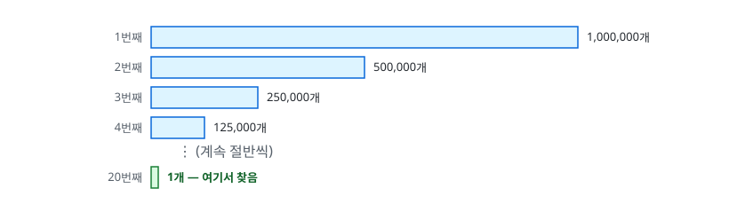
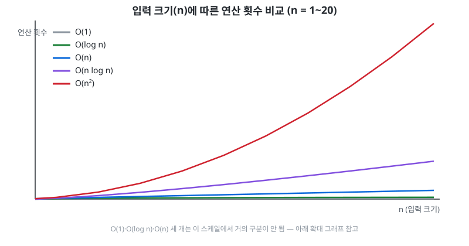
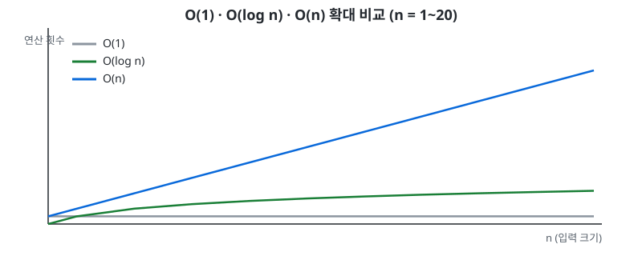

# 0.2 Big-O

## Big-O가 뭘 재는 건가

Big-O는 입력 크기 `n`이 커질 때 걸리는 시간(또는 공간)이 얼마나 빨리 늘어나는지를 재는 표기법이다. 정확한 초 단위 시간이 아니라 **증가하는 패턴**을 본다.

전화번호부에서 이름을 찾는 상황으로 비유하면:

- 색인을 보고 바로 그 페이지로 감 — 페이지가 몇 장이든 거의 같은 시간, O(1)
- 첫 페이지부터 한 장씩 넘김 — 페이지가 2배면 걸리는 시간도 거의 2배, O(n)

## O(1) vs O(n) — 배열 접근

```kotlin
arr[5]            // O(1)
arr.contains(5)    // O(n), 정렬 안 된 배열이라고 가정
```

`arr[5]`가 O(1)인 이유는 배열이 메모리에 연속으로 저장되기 때문이다. 시작 주소만 알면 `base_address + 5 × (원소 크기)` 계산 한 번으로 위치를 바로 찾는다. `n`이 몇이든 이 계산은 항상 한 번이다.

`contains(5)`는 정렬이 안 되어 있으니 처음부터 하나씩 대조하는 수밖에 없고, 최악의 경우 끝까지 다 봐야 한다.

## O(log n) — 정렬된 배열의 이진 탐색

배열이 정렬되어 있으면 `contains`를 O(n)보다 훨씬 빠르게 할 수 있다. 가운데 원소를 보고, 찾는 값이 더 크면 왼쪽 절반을 버리고 오른쪽에서 계속 찾는다 — 정렬되어 있으니 가운데보다 큰 값은 무조건 가운데보다 오른쪽에 있기 때문이다. 반대로 찾는 값이 더 작으면 오른쪽 절반을 버리고 왼쪽에서 찾는다. 매번 절반씩 버리는 것.



정렬된 1,000,000개 중에서 이진 탐색으로 값을 찾으면 최악의 경우에도 약 20번이면 끝난다. `2^10 = 1024`이므로 `2^20 = 1024 × 1024 ≈ 1,048,576`, 즉 백만 근처다. 정렬 안 된 배열이었다면 최악의 경우 100만 번을 봐야 했을 것을, 정렬만 되어 있으면 20번으로 줄어든다.

## O(n²) — 중첩 반복문

```kotlin
fun hasDuplicate(arr: IntArray): Boolean {
    for (i in arr.indices) {
        for (j in arr.indices) {
            if (i != j && arr[i] == arr[j]) return true
        }
    }
    return false
}
```

반복문이 두 겹이라 최악의 경우 비교를 대략 `n × n = n²`번 한다. 입력이 1,000개에서 2,000개로 2배가 되면, 비교 횟수는 `1,000² = 1,000,000`에서 `2,000² = 4,000,000`으로 **4배**가 된다.

## 입력을 2배로 늘렸을 때 — 복잡도를 거꾸로 추측하는 감각

측정해보고 실제로 몇 배 느려지는지를 보면 복잡도를 역으로 추측할 수 있다.

| 입력을 2배로 늘렸을 때 | 복잡도 |
|---|:--:|
| 시간도 거의 그대로 | O(log n) 또는 O(1) |
| 시간도 딱 2배 | O(n) |
| 시간이 4배 | O(n²) |
| 시간이 8배 | O(n³) |

## 성장 비교

O(1), O(log n), O(n), O(n log n), O(n²)을 같은 그래프에 놓고 n = 1~20 구간을 보면 차이가 확연하다.



O(1)과 O(log n)은 바닥에 거의 붙어있는 반면 O(n²)은 급격히 치솟는다. n이 더 커질수록 이 격차는 훨씬 더 벌어진다.

O(1) / O(log n) / O(n) 세 개는 위 그래프 스케일에서는 서로 구분이 안 될 정도로 붙어있다. 그 세 개만 따로 확대하면:



O(1)은 완전히 평평하고, O(log n)은 n이 커져도 아주 조금씩만 늘어나고, O(n)은 뚜렷하게 비례해서 늘어나는 게 보인다.

## O(n log n) — 정렬

정렬(merge sort 등)이 대표적이다. n개를 절반씩 쪼개는 데 log n단계가 걸리고, 각 단계마다 전체 n개를 훑으며 합치는 작업을 하므로 `n × log n`이다. O(n²) 정렬(버블 정렬 등)보다 훨씬 빨라서, 코틀린 `sorted()`류 함수들이 내부적으로 이 정도 복잡도를 쓴다.

## 시간 vs 공간 트레이드오프

해시테이블이 대표 예시다. 배열에서 값 찾기는 O(n)인데, 해시테이블을 쓰면 O(1)로 줄일 수 있다. 대신 그 값을 담을 추가 메모리(해시 테이블 자체)를 쓴다. 시간을 아끼려고 공간을 쓰는 거래인 셈.

## 최선 / 평균 / 최악 케이스

정렬 안 된 배열에서 값 찾기를 예로 들면:

- 찾는 값이 첫 원소 — 최선, O(1)
- 찾는 값이 중간쯤 — 평균, 대략 O(n/2)지만 결국 O(n)
- 찾는 값이 마지막이거나 아예 없음 — 최악, O(n)

Big-O라고 하면 보통 **최악 케이스**를 기준으로 말하는 관습이 있다. "이 알고리즘은 최악의 경우에도 이 정도는 보장된다"는 의미이기 때문이다.

## 배열 O(1) vs 연결 리스트 O(n)

배열은 연속된 메모리라 주소 계산으로 바로 접근되지만(O(1)), 연결 리스트는 노드들이 메모리 여기저기 흩어져 있어서 원하는 위치까지 노드를 하나씩 따라가야 한다(O(n)). 1.3에서 연결 리스트를 직접 만들어보면 이 차이가 훨씬 확실히 체감된다.

## 요약

- Big-O는 입력이 커질 때 시간(또는 공간)이 늘어나는 패턴을 본다. 정확한 초 단위가 아니다.
- O(1) < O(log n) < O(n) < O(n log n) < O(n²) 순으로 느려진다.
- 입력을 2배로 늘렸을 때 몇 배 느려지는지 보면 복잡도를 거꾸로 추측할 수 있다.
- 시간과 공간은 트레이드오프 관계일 수 있다 — 해시테이블처럼 공간을 더 써서 시간을 아낀다.
- Big-O는 보통 최악 케이스 기준으로 말한다.
