# 0.3 재귀

## 재귀란

재귀(recursion)는 함수가 자기 자신을 호출하는 것이다. 구성 요소는 두 개뿐이다.

- **종료 조건(base case)** — 더 이상 자기 자신을 호출하지 않고 바로 답을 반환하는 조건. 이게 없으면 무한히 호출된다.
- **재귀 호출(recursive case)** — 문제를 조금 더 작은 버전으로 줄여서 자기 자신을 다시 호출하는 부분.

팩토리얼(`n!`)로 보면:

```kotlin
fun factorial(n: Int): Int {
    if (n <= 1) return 1        // 종료 조건
    return n * factorial(n - 1) // 재귀 호출
}
```

`factorial(4)`는 `4 * factorial(3)`이고, `factorial(3)`은 `3 * factorial(2)`... 이런 식으로 계속 작아지다가 `factorial(1)`에서 멈춘다.

## 콜스택이 쌓이는 과정

0.1에서 다룬 스택 메모리가 여기서 그대로 쓰인다. 함수를 호출할 때마다 그 호출이 스택에 하나씩 쌓인다(push).

```
factorial(4) 호출
  └─ factorial(3) 호출
       └─ factorial(2) 호출
            └─ factorial(1) 호출 → 종료 조건! 바로 1 반환
```

`factorial(4)`는 `factorial(3)`의 결과를 알아야 자기 곱셈을 할 수 있다. `factorial(3)`도 `factorial(2)`의 결과가 필요하고, 이런 식으로 "다음 호출이 끝날 때까지 기다리는" 함수들이 스택에 계속 쌓인다. `factorial(1)`에 도달해서야 처음으로 기다릴 필요 없이 바로 답이 나온다.

곱셈은 스택이 다 쌓인 **뒤에**, 안쪽(가장 나중에 호출된 것)부터 바깥쪽으로 풀리면서 일어난다(pop).

```
factorial(1) = 1                    ← 반환
factorial(2) = 2 * 1  = 2           ← 반환
factorial(3) = 3 * 2  = 6           ← 반환
factorial(4) = 4 * 6  = 24          ← 반환
```

그래서 실제 곱셈이 벌어지는 순서는 `1×2`, `(그 결과)×3`, `(그 결과)×4` — 작은 것부터다. 아래는 이 push/pop 과정을 그대로 애니메이션으로 표현한 것이다.



## 스택 오버플로우

`factorial(n)`에서 종료 조건(`if (n <= 1) return 1`)을 빼먹으면, 반환이 일어나지 않으니 pop 없이 push만 계속된다. 그런데 스택 메모리는 무한하지 않다 — 0.1에서 다룬 것처럼 힙보다 훨씬 작은, 정해진 크기의 메모리 영역이다(보통 몇 MB 수준). push만 계속되면 이 한정된 공간을 다 채우는 순간 `StackOverflowError`가 터지면서 프로그램이 죽는다. "무한 재귀"라고 부르지만 실제로는 "유한한 스택 공간을 다 쓸 때까지"라는 뜻이다.

## 재귀 vs 반복문 — 언제 재귀가 자연스러운가

`factorial`만 보면 재귀가 왜 필요한지 잘 와닿지 않는다. `for`문으로도 충분하기 때문이다. 진짜 이유는 **데이터 자체가 재귀적으로 정의되어 있을 때** 드러난다.

연결 리스트를 정의하면 이렇다: "리스트는 (비어있거나) 노드 하나 + 그 다음에 오는 나머지 리스트다." 그런데 "나머지 리스트"도 결국 똑같은 정의를 가진 리스트다 — 구조 안에 자기 자신과 똑같은 모양의 더 작은 구조가 들어있는 것. 이 정의를 그대로 코드로 옮기면 재귀가 된다.

```kotlin
fun printAll(node: Node?) {
    if (node == null) return   // 종료 조건: 리스트가 비었으면 끝
    println(node.value)
    printAll(node.next)        // "나머지 리스트"도 똑같은 함수로 처리
}
```

트리는 "노드 하나 + 왼쪽 서브트리 + 오른쪽 서브트리"인데, 서브트리도 각각 트리다.

```kotlin
fun printAll(node: TreeNode?) {
    if (node == null) return
    println(node.value)
    printAll(node.left)   // 왼쪽도 결국 트리 하나
    printAll(node.right)  // 오른쪽도 결국 트리 하나
}
```

이걸 반복문만으로 짜려면 "지금까지 어디까지 봤는지" 직접 기억해둘 자료구조(스택 같은)를 손수 만들어야 한다. 재귀를 쓰면 그 역할을 콜스택이 자동으로 해준다 — 함수 호출 자체가 스택에 쌓이기 때문이다. 그래서 가지가 여러 갈래로 뻗는 트리 같은 구조에서는 재귀가 반복문보다 훨씬 짧고 자연스럽다.

물론 공짜는 아니다. 재귀는 호출마다 스택을 쓰므로, 구조가 너무 깊으면 스택 오버플로우 위험이 있다. "구조가 재귀적으로 정의됐다 → 재귀로 짜는 게 자연스럽다"는 것이지, "항상 재귀가 이긴다"는 뜻은 아니다.

## 요약

- 재귀 = 종료 조건 + 재귀 호출. 종료 조건이 없으면 스택 오버플로우.
- 호출은 스택에 push되고, 종료 조건에 도달해야 pop이 시작되며 그 순서대로 계산이 풀린다.
- 스택 메모리는 크기가 정해져 있어서, push만 계속되면 언젠가 `StackOverflowError`로 터진다.
- 데이터 자체가 재귀적으로 정의된 구조(연결 리스트, 트리)를 다룰 때 재귀가 자연스럽다 — 콜스택이 "기억해야 할 것"을 대신 관리해주기 때문이다.
