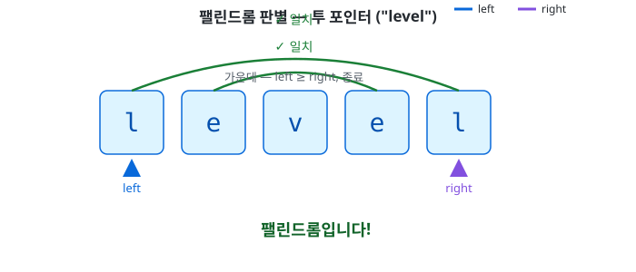
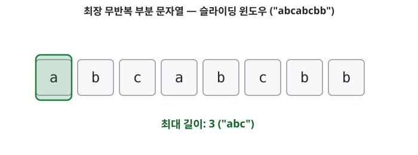

# 1.2 문자열

## 불변 문자열

코틀린의 `String`은 불변(immutable)이다 — 한번 만들어지면 내부 내용을 절대 바꿀 수 없다. `+`나 `+=`로 이어붙이면 기존 문자열을 고치는 게 아니라 새 문자열 객체를 힙에 만든다.

```kotlin
var s = "hello"
val original = s
s += " world"

println(original) // hello       (그대로)
println(s)         // hello world (새 객체)
```

- `s`(`var`) — 재할당되어 새 `"hello world"` 객체를 가리키게 됨
- `original`(`val`) — 원래 `"hello"` 객체를 계속 그대로 가리킴

## StringBuilder — 반복 연결

반복문에서 `+=`로 계속 이어붙이면 매 반복마다 그 시점까지 쌓인 길이만큼 전부 복사해야 한다.

```kotlin
var result = ""
for (i in 1..n) {
    result += i.toString()
}
```

- 각 반복 비용이 대략 `0, 1, 2, ..., n-1`로 늘어나 총합이 `n²/2`, 즉 O(n²)
- `StringBuilder`는 내부에 가변 문자 배열(버퍼)을 들고 있다가, 버퍼가 꽉 찼을 때만 가끔 2배로 늘린다 — 그래서 n번 `append()`해도 총 비용은 O(n)

```kotlin
val sb = StringBuilder()
for (i in 1..n) {
    sb.append(i)
}
val result = sb.toString() // 여기서 딱 한 번 진짜 String으로 변환
```

## 투 포인터 — 팰린드롬 판별

배열/문자열은 인덱스로 O(1) 접근되므로, 양 끝에서 시작하는 두 포인터를 자유롭게 움직일 수 있다. 팰린드롬(앞뒤로 읽어도 같은 문자열)을 O(n)에 판별한다.

```kotlin
fun isPalindrome(s: String): Boolean {
    var left = 0
    var right = s.length - 1

    while (left < right) {
        if (s[left] != s[right]) return false
        left++
        right--
    }

    return true
}
```

`left < right`라는 조건 하나로 문자열 길이가 짝수든 홀수든 다 처리된다 — 홀수 길이면 가운데 글자는 `left == right`가 되는 순간 루프가 끝나서 자기 자신과 비교할 필요 없이 자동으로 건너뛰어진다.



## 슬라이딩 윈도우 — 최장 무반복 부분 문자열

`[left, right]` 구간(윈도우)을 유지하면서, `right`를 넓히다가 중복이 생기면 `left`를 당겨서 중복을 없애는 패턴이다.

```kotlin
fun lengthOfLongestSubstring(s: String): Int {
    val seen = mutableSetOf<Char>()
    var left = 0
    var maxLen = 0

    for (right in s.indices) {
        while (seen.contains(s[right])) {
            seen.remove(s[left])
            left++
        }
        seen.add(s[right])
        maxLen = maxOf(maxLen, right - left + 1)
    }

    return maxLen
}
```

- `HashSet`을 쓰는 이유 — 윈도우 안에 어떤 문자가 있는지 O(1)에 확인하려고 (시간을 아끼려고 공간을 쓰는 트레이드오프)
- `if`가 아니라 `while`인 이유 — 왼쪽에서 하나씩 지워도 그게 바로 그 중복 문자가 아닐 수 있어서, 진짜 중복이 없어질 때까지 계속 지워야 함
- `seen.remove(s[left])`가 정확한 이유 — set 안의 아무 원소나 지우는 게 아니라, `left`(원본 문자열의 특정 인덱스)가 가리키는 정확히 그 문자를 지우는 것. set 자체는 정렬 안 되어 있지만, 어떤 순서로 지울지는 `left`가 원본 문자열을 따라가며 결정함
- 전체가 O(n)인 이유 — `left`와 `right`가 각각 앞으로만 움직이고(뒤로 안 감), 문자 하나하나는 윈도우에 들어갔다 나오는 게 각각 한 번씩이라서 `while`이 가끔 여러 번 돌아도 총합은 O(n)



## 해시 기반 카운팅 — 애너그램 판별

두 문자열이 같은 문자들로(개수까지) 이루어졌는지 확인한다. `Map<Char, Int>`로 문자별 개수를 세면 O(n)에 된다.

```kotlin
fun isAnagram(s1: String, s2: String): Boolean {
    val counts = mutableMapOf<Char, Int>()

    for (c in s1) {
        counts[c] = (counts[c] ?: 0) + 1
    }

    for (c in s2) {
        counts[c] = (counts[c] ?: 0) - 1
    }

    return counts.values.all { it == 0 }
}
```

- `s1`을 돌며 개수를 `+1`
- `s2`를 돌며 개수를 `-1` (map에 없던 문자면 `-1`로 새로 생김)
- 마지막에 모든 값이 0인지 확인 — 길이가 다르거나 개수가 다르면 어떤 문자든 0이 아닌 값이 남으므로, 길이를 따로 비교할 필요 없이 이 규칙 하나로 다 걸러짐

## 요약

- `String`은 불변 — `+`/`+=`는 항상 새 객체를 만든다. 반복 연결엔 `StringBuilder`(내부는 가변 버퍼라 총 비용이 O(n)).
- 투 포인터 — 양 끝(또는 서로 다른 속도)에서 움직이는 두 인덱스로 O(n²)을 O(n)으로 줄인다. 인덱스 O(1) 접근이 가능한 구조(배열/문자열)에서만 이렇게 쓸 수 있다.
- 슬라이딩 윈도우 — 투 포인터의 한 종류. `[left, right]` 구간을 유지하며 조건에 따라 넓히고/좁힌다. 두 포인터가 각각 한 방향으로만 움직여야 O(n)이 보장된다.
- 개수를 세야 하는 문제(애너그램 등)는 `Map<Char, Int>`로 O(n)에 푼다.
