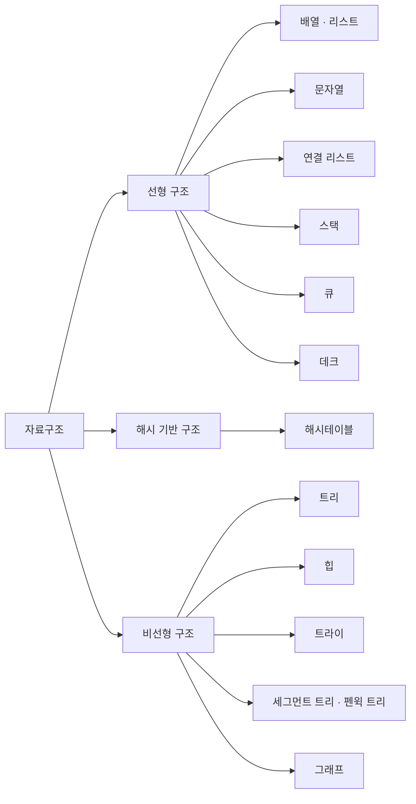
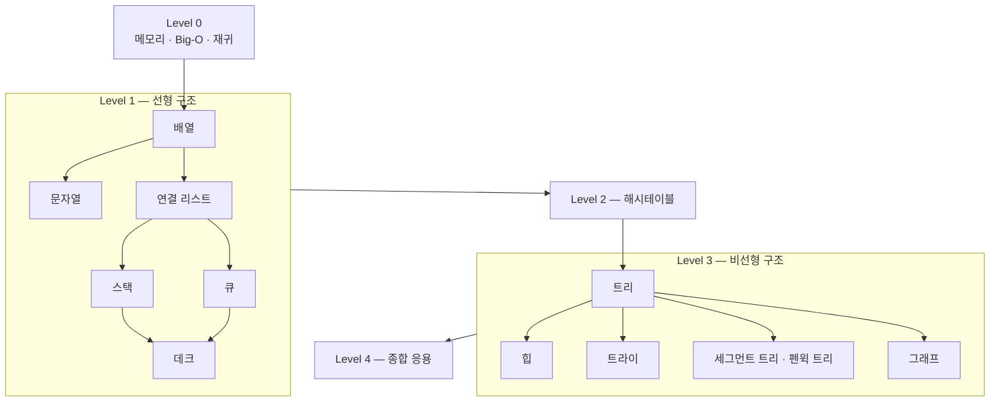

# data-structure — 자료구조

자료구조를 코틀린으로 직접 구현하며 익힌다. 주제마다 다음 순서를 지킨다.

```
개념 → 직접 구현 → 코틀린 표준 라이브러리 대응 → 인터뷰 문제
```

## 분류



## 학습 순서



---

## Level 0 — 기초

자료구조 자체보다 먼저 필요한 감각.

### 메모리와 참조

- 값(value) vs 참조(reference) — 코틀린은 객체를 항상 참조로 다룬다
- 스택 메모리 vs 힙 메모리 — 지역 변수는 스택에, 객체 인스턴스는 힙에 생긴다
- `null`이 "가리키는 대상이 없다"는 뜻인 이유
- 같은 참조를 두 변수가 가리킬 때, 한쪽에서 내부 값을 바꾸면 다른 쪽에도 반영되는 이유

### Big-O

- O(1), O(log n), O(n), O(n log n), O(n²) — 각각 예시로 감 잡기
- 정렬된 배열에서 이진 탐색이 O(log n)인 이유를 손으로 따라가보기
- 시간 복잡도와 공간 복잡도는 다른 축이라는 것 — 해시테이블처럼 공간을 더 써서 시간을 아끼는 트레이드오프
- 최선/평균/최악 케이스 구분
- 배열 임의 접근 O(1) vs 연결 리스트 임의 접근 O(n) 비교로 자료구조 선택이 성능을 좌우함을 체감

### 재귀

- 재귀 = 종료 조건 + 자기 자신을 호출하는 부분
- 재귀 vs 반복문 — 트리·연결 리스트처럼 자기 자신과 같은 모양의 부분 구조를 가진 데이터에 재귀가 자연스러운 이유
- 콜스택이 쌓이는 과정을 손으로 그려보기 (팩토리얼 예제)
- 스택 오버플로우가 왜 발생하는지

---

## Level 1 — 선형 구조

### 1.1 배열 · 리스트

- 정적 배열 — 크기 고정, 인덱스 접근이 O(1)인 이유(메모리 연속 배치)
- 동적 배열(ArrayList) 원리 — 꽉 차면 더 큰 배열로 복사(보통 2배 증가), 그래도 삽입이 평균 O(1)인 이유
- 직접 구현: `MyArrayList<T>` — 내부 `Array<Any?>` + `size` + `resize()`
- 코틀린 대응: `Array`(고정 크기) vs `ArrayList`/`MutableList`(가변 크기)
- 인터뷰 문제: 배열 회전, 두 정렬 배열 병합, 중복 원소 제거

### 1.2 문자열

- 불변(immutable) 문자열 — 코틀린 `String`은 수정 불가, 수정할 때마다 새 문자열이 생기는 이유
- 반복 연결 시 `StringBuilder`를 쓰는 이유 — `+=` 반복은 O(n²), `StringBuilder`는 O(n)
- 인터뷰 패턴 — 투 포인터, 슬라이딩 윈도우
- 인터뷰 문제: 팰린드롬 판별, 최장 무반복 부분 문자열, 애너그램 판별

### 1.3 연결 리스트

- 개념 — 노드(값 + 다음 노드 참조)들의 연결, 메모리가 연속이 아니라는 게 배열과의 핵심 차이
- 직접 구현: 싱글 연결 리스트 — `append`, `insert(index)`, `delete(index)`, `search`, `traverse`
- 직접 구현: 더블 연결 리스트 — `prev`/`next` 양방향
- 원형 연결 리스트는 개념만 (`tail.next == head`)
- 코틀린 대응: `java.util.LinkedList` — 배열 대비 언제 유리한가(중간 삽입/삭제 O(1)), 언제 불리한가(임의 접근 O(n))
- 인터뷰 문제: 리스트 뒤집기, 사이클 탐지(Floyd), 중간 노드 찾기(느린/빠른 포인터), 두 정렬 리스트 병합
- 함정 — `head`를 직접 옮기며 순회하면 시작점을 잃는다. 별도 순회용 변수를 두고, 삽입/삭제 시 끊기 전에 다음 참조부터 저장할 것

### 1.4 스택

- LIFO 개념 — 함수 호출 스택도 이 구조
- 직접 구현: 배열 기반 `MyStack<T>` (`push`/`pop`/`peek`)
- 직접 구현: 연결 리스트 기반 스택 (head에서 push/pop)
- 코틀린 대응: `ArrayDeque`를 스택으로 (`addLast`/`removeLast`)
- 인터뷰 문제: 괄호 유효성 검사, 최솟값을 O(1)에 꺼내는 스택, 후위표기법 계산기

### 1.5 큐

- FIFO 개념
- 직접 구현: 배열 기반 원형 큐(circular buffer) — 단순 배열 큐에서 앞쪽 공간이 버려지는 문제를 원형 인덱싱으로 해결
- 직접 구현: 연결 리스트 기반 큐 (tail에서 삽입, head에서 삭제)
- 코틀린 대응: `ArrayDeque`를 큐로 (`addLast`/`removeFirst`)
- 인터뷰 문제: 큐 2개로 스택 만들기, 스택 2개로 큐 만들기

### 1.6 데크

- 양쪽 끝 삽입/삭제가 모두 O(1)인 구조
- 코틀린 `ArrayDeque` 자체가 데크 구현체 — 직접 구현은 1.5 원형 큐를 양방향으로 확장하면 됨
- 인터뷰 문제: 슬라이딩 윈도우 최댓값

---

## Level 2 — 해시 기반 구조

### 2.1 해시테이블

- 해시 함수 개념 — 키를 배열 인덱스로 바꾸는 방법
- 충돌 해결 — 체이닝(각 버킷에 연결 리스트, 1.3 재사용) vs 오픈 어드레싱
- 직접 구현: `MyHashMap<K, V>` — 배열 + 체이닝으로 `put`/`get`/`remove`
- load factor와 resize 시점 — 1.1 동적 배열의 resize와 같은 발상
- 코틀린 대응: `HashMap`/`HashSet` 내부 동작, `equals`/`hashCode` 계약
- 인터뷰 문제: 두 수의 합, 그룹 애너그램, 처음 등장하는 반복 안 되는 문자

---

## Level 3 — 비선형 구조

### 3.1 트리

- 용어 — root/leaf/부모-자식/depth/height
- 직접 구현: `TreeNode<T>` 이진 트리
- 순회 — 전위/중위/후위(재귀), 레벨 순회(큐 재사용)
- 직접 구현: 이진 탐색 트리(BST) — `insert`/`search`/`delete`
- 균형 개념만 — AVL/레드-블랙 트리라는 이름과, 한쪽으로 편향되면 O(n)으로 퇴화하는 이유
- 인터뷰 문제: 최대 깊이, 두 트리가 같은지 판별, BST 유효성 검사, 최소 공통 조상(LCA)

### 3.2 힙 / 우선순위 큐

- 완전 이진 트리를 배열 하나로 표현하는 트릭 — 부모 인덱스 `(i-1)/2`, 자식 인덱스 `2i+1`/`2i+2`
- 직접 구현: `heapifyUp`/`heapifyDown`, `insert`, `extractMin`
- 최소 힙 vs 최대 힙
- 코틀린 대응: `PriorityQueue`(기본 최소 힙), `reverseOrder()`, `compareBy`
- 인터뷰 문제: K번째로 큰 수, 힙 정렬

### 3.3 트라이 (Trie)

- 개념 — 문자열 집합을 트리(3.1)로 표현, 공통 접두사를 공유해서 검색을 O(문자열 길이)로
- 직접 구현: `TrieNode` (자식 맵 + 단어 끝 표시) — `insert`/`search`/`startsWith`
- 인터뷰 문제: 자동완성, 단어 검색

### 3.4 세그먼트 트리 · 펜윅 트리 (BIT)

- 개념 — 구간 합/구간 최솟값처럼 "범위 질의"를 배열 순회 O(n) 대신 O(log n)에 처리
- 직접 구현: 세그먼트 트리 — `build`/`update`/`query` (완전 이진 트리를 배열로, 3.2 힙과 같은 인덱싱 발상)
- 직접 구현: 펜윅 트리 — 더 짧은 구현으로 구간 합에 특화
- 인터뷰 문제: 구간 합 구하기, 구간 최솟값 구하기

### 3.5 그래프

- 표현 방법 — 인접 리스트 vs 인접 행렬, 언제 뭘 쓰나
- 직접 구현: BFS (큐 재사용)
- 직접 구현: DFS (재귀 또는 스택 재사용)
- 위상 정렬 개념
- Union-Find(Disjoint Set) 개념만
- 최단 경로 — 다익스트라(가중치 그래프, 힙 재사용)
- 최소 신장 트리(MST) — 크루스칼(Union-Find 재사용) 또는 프림 개념
- 인터뷰 문제: 섬의 개수, 최단 경로(BFS/다익스트라), 사이클 탐지

---

## Level 4 — 종합 응용

- LRU 캐시 — 해시맵(2.1) + 더블 연결 리스트(1.3) 조합으로 직접 구현 (get/put O(1))
- 자동완성 끄고 빈 에디터에서, Level 1~3 중 하나를 무작위로 골라 처음부터 구현
- 시간 제한을 두고 직접 구현 + 스스로 만든 테스트케이스로 검증

---

## 정리 문서

| 주제 | 문서 |
|---|---|
| 배열 · 리스트 | _작성 예정_ |
| 문자열 | _작성 예정_ |
| 연결 리스트 | _작성 예정_ |
| 스택 · 큐 · 덱 | _작성 예정_ |
| 해시테이블 | _작성 예정_ |
| 트리 · BST | _작성 예정_ |
| 힙 / 우선순위 큐 | _작성 예정_ |
| 트라이 | _작성 예정_ |
| 세그먼트 트리 · 펜윅 트리 | _작성 예정_ |
| 그래프 | _작성 예정_ |
